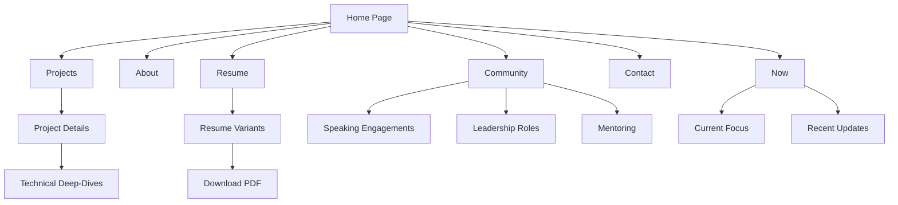

# Personal Portfolio & Resume Site

An interactive extension of my professional resume built with Next.js, offering a comprehensive view of my experience, projects, and community involvement. This platform goes beyond traditional resumes by providing detailed insights into my technical journey and professional impact.

## 🌟 Features

- **Dynamic Resume Variants**: Multiple resume versions tailored for different roles
- **Project Showcase**: Detailed technical deep-dives into various projects
- **Community Involvement**: Comprehensive overview of speaking engagements and community leadership
- **Now Page**: Current focus areas and ongoing professional development
- **PDF Downloads**: Downloadable resume variants
- **Responsive Design**: Modern, mobile-first interface
- **Dark/Light Mode**: Theme support for better readability

## 🔧 Tech Stack

- **Framework**: Next.js 14 (App Router)
- **Styling**: Tailwind CSS
- **Language**: TypeScript
- **Deployment**: Vercel
- **PDF Generation**: Custom PDF handling
- **Icons**: Heroicons

## 📋 Prerequisites

- Node.js 18.x or higher
- npm or yarn
- Git

## 🚀 Getting Started

1. **Clone the repository**

   ```bash
   git clone https://github.com/yourusername/your-repo-name.git
   cd your-repo-name
   ```

2. **Install dependencies**

   ```bash
   npm install
   # or
   yarn install
   ```

3. **Set up environment variables**

   ```bash
   cp .env.example .env.local
   ```

   Edit `.env.local` with your configuration:

   ```
   NEXT_PUBLIC_SITE_URL=http://localhost:3000
   ```

4. **Run the development server**

   ```bash
   npm run dev
   # or
   yarn dev
   ```

5. **Open your browser**
   Navigate to [http://localhost:3000](http://localhost:3000)

## 🗂️ Project Structure

```
├── src/
│   ├── app/                 # Next.js app router pages
│   ├── components/          # Reusable React components
│   ├── lib/                 # Utilities and data
│   │   ├── data/           # Content data files
│   │   └── utils/          # Helper functions
│   └── styles/             # Global styles
├── public/                  # Static assets
│   ├── images/             # Image assets
│   └── pdfs/               # Resume PDF files
└── tailwind.config.js      # Tailwind configuration
```

## 🔄 Site Workflow



## 🔍 Key Features Implementation

### Resume Variants

- Located in `src/lib/data/resume/`
- Each variant has its own data file
- PDF downloads handled through API routes

### Theme Support

- Uses Tailwind dark mode
- Custom color variables in `tailwind.config.js`
- Theme toggle persisted in local storage

### Content Management

- Data stored in TypeScript files under `src/lib/data/`
- Strongly typed content structure
- Easy to update and maintain

## 📝 Content Updates

### Adding a New Project

1. Add project data to `src/lib/data/projects.ts`
2. Add images to `public/images/projects/`
3. Create new component if needed in `src/components/projects/`

### Updating Resume

1. Modify relevant variant in `src/lib/data/resume/`
2. Update PDF in `public/pdfs/`
3. Update download links in resume component

## 🛠️ Development Workflow

1. Create feature branch
2. Make changes
3. Run tests: `npm run test`
4. Check types: `npm run type-check`
5. Format code: `npm run format`
6. Create pull request

## 🔒 Security Considerations

- No sensitive data in public files
- Environment variables for configuration
- PDF files served through API routes
- Input sanitization on forms

## 📦 Deployment

The site is configured for deployment on Vercel:

1. Connect repository to Vercel
2. Configure environment variables
3. Deploy main branch

## 🤝 Contributing

1. Fork the repository
2. Create feature branch
3. Commit changes
4. Push to branch
5. Open pull request

## 📄 License

This project is licensed under the MIT License - see the LICENSE file for details.

## 🔮 Future Enhancements

- [ ] Blog section for technical writing
- [ ] Interactive project demos
- [ ] Automated PDF generation
- [ ] Analytics dashboard
- [ ] RSS feed for updates

## 🐛 Known Issues

- None currently documented

## 📞 Support

For questions or issues, please open a GitHub issue or reach out through the contact form on the site.
